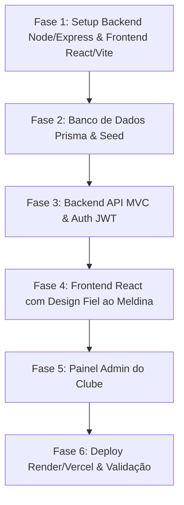

# Plano de Implementação Full-Stack: Meldina FC (Fidelidade Visual + React + Node/Express MVC)

> **Para executores agenticos:** SUB-SKILL REQUERIDA: Use `superpowers:subagent-driven-development` (recomendado) ou `superpowers:executing-plans` para implementar este plano tarefa por tarefa. As etapas utilizam a sintaxe de checkbox (`- [ ]`) para acompanhamento.

**Meta:** Transformar o site estático do Meldina FC em uma aplicação full-stack dinâmica e profissional com backend em Node.js/Express (MVC em TypeScript) e frontend em React (Vite + TypeScript + Tailwind CSS), mantendo **100% de fidelidade visual ao design do "Meldina site"** e custo R$ 0/mês.

**Arquitetura:** 
- **Frontend:** React 18+ SPA com Vite e Tailwind CSS customizado com a paleta exata do clube (Grená `#8F0010`, Ouro `#EFAA19`, Marinho `#001065`, Noite `#040720`) e tipografias (*Anton*, *Cinzel*, *DM Serif*, *Poppins*).
- **Backend:** Node.js + Express + TypeScript em arquitetura limpa MVC (Controllers -> Services -> Repositories), validação com Zod, autenticação JWT para administradores e logs estruturados em JSON.
- **Database:** PostgreSQL (Neon / Supabase Free Tier permanente) gerenciado via Prisma ORM.

**Spec / Intenção:** [docs/intent/fullstack-meldinafc.md](file:///c:/Programacao/meldinafc-website/docs/intent/fullstack-meldinafc.md)

---

## Restrições Globais (Global Constraints)
1. **Fidelidade Visual Absoluta:** O frontend React deve reproduzir com exatidão a identidade visual, layout, banners, cards, modais e transições já desenhados na pasta `Meldina site`.
2. **Backend Node.js + Express (MVC):**
   - *Controllers:* Recebem requisições HTTP, validam schemas com Zod e respondem JSON.
   - *Services:* Regras de negócio do clube (validações, cálculos, processamento).
   - *Repositories:* Acesso aos dados via Prisma ORM.
3. **Custo Zero (Free Tier):** Backend configurado para Render, Frontend para Vercel/Cloudflare Pages e Banco no Neon/Supabase sem expiração.
4. **Tipagem Estrita:** TypeScript `strict: true` em todo o código.

---

## Foco de Revisão (Review Focus)
1. **Preservação Visual dos Componentes:** Hero, cards de jogadores com fotos, tabela de jogos/classificação e página do sócio devem ser idênticos ao protótipo de `Meldina site`.
2. **Tratamento de Cold-Start no Render:** Interceptor do Axios no React com indicador de status suave (*"Conectando aos servidores do Meldina..."*) durante o aquecimento da API gratuita.
3. **Segurança de Autenticação Admin:** Rotas de alteração de dados protegidas com JWT middleware e senhas criptografadas com `bcrypt`.
4. **Validação de Formulários:** Sanitização e validação Zod no backend para cadastro de sócios (CPF, e-mail único, telefone).
5. **Políticas de CORS:** Permitir requisições apenas do domínio do frontend com suporte a preflight options.

---

## Estrutura de Pastas do Projeto

```
meldinafc-website/
├── backend/                      # API Node.js + Express + TypeScript (MVC)
│   ├── src/
│   │   ├── controllers/          # HTTP Controllers (News, Fixtures, Players, Standings, Members, Auth)
│   │   ├── services/             # Business Logic Layer
│   │   ├── repositories/         # Prisma Data Access Layer
│   │   ├── models/               # Zod Schemas & Domain Types
│   │   ├── middlewares/          # JWT Auth, Error Handler, Request Logger
│   │   ├── routes/               # Express Route Definitions
│   │   ├── prisma/               # Prisma Schema & Seed
│   │   ├── app.ts                # Express App Configuration
│   │   └── server.ts             # Server entry point
│   ├── package.json
│   └── tsconfig.json
│
├── frontend/                     # React + Vite + TypeScript + Tailwind CSS
│   ├── public/assets/            # Imagens, fotos de atletas e logos do "Meldina site"
│   ├── src/
│   │   ├── components/
│   │   │   ├── layout/           # Navbar, Footer, Banner
│   │   │   ├── home/             # Hero, NextMatch, RecentResults, NewsHighlight
│   │   │   ├── squad/            # PlayerCard, PlayerModal, SquadFilter
│   │   │   ├── matches/          # MatchCard, StandingsTable
│   │   │   ├── news/             # NewsCard, NewsGrid
│   │   │   ├── socio/            # PlanCard, SignupForm, PixModal
│   │   │   └── admin/            # AdminNavbar, AdminSidebar, ProtectedRoute
│   │   ├── pages/
│   │   │   ├── Home.tsx
│   │   │   ├── Elenco.tsx
│   │   │   ├── Jogos.tsx
│   │   │   ├── Noticias.tsx
│   │   │   ├── NoticiaDetalhe.tsx
│   │   │   ├── Clube.tsx
│   │   │   ├── Socio.tsx
│   │   │   └── admin/            # Dashboard, Gerenciar Notícias, Jogos, Elenco, Sócios
│   │   ├── services/             # Axios API Client & Endpoints
│   │   ├── types/                # TypeScript Interfaces
│   │   ├── App.tsx               # Router Setup
│   │   └── index.css             # Tailwind + Variáveis CSS do Meldina
│   ├── tailwind.config.js        # Design Tokens (Grená, Ouro, Marinho, Noite)
│   ├── vite.config.ts
│   └── package.json
│
└── docs/                         # Documentação, Intenção e ADRs
```

---

## Fases e Tarefas de Implementação



---

### Fase 1: Setup do Backend (Node/Express) e Frontend (React/Vite)

#### Tarefa 1.1: Backend Node.js + Express + TypeScript
**Arquivos:**
- Criar: `backend/package.json`
- Criar: `backend/tsconfig.json`
- Criar: `backend/src/app.ts`
- Criar: `backend/src/server.ts`

- [ ] **Passo 1: Inicializar `backend/package.json` com dependências (`express`, `cors`, `dotenv`, `zod`, `pino`, `pino-http`, `bcryptjs`, `jsonwebtoken`, `tsx`, `typescript`, `@types/...`)**
- [ ] **Passo 2: Configurar `tsconfig.json` e `app.ts` com middlewares de CORS, JSON e Logger**
- [ ] **Passo 3: Criar rota de healthcheck `GET /api/health` e testar inicialização**
- [ ] **Passo 4: Commit**
  ```bash
  git add backend/
  git commit -m "feat(backend): initialize node express typescript server"
  ```

#### Tarefa 1.2: Frontend React + Vite + TypeScript + Tailwind (Tokens Meldina)
**Arquivos:**
- Criar: `frontend/package.json`
- Criar: `frontend/vite.config.ts`
- Criar: `frontend/tailwind.config.js`
- Criar: `frontend/src/index.css`
- Copiar: `Meldina site/assets/img/` e `Meldina site/assets/players/` para `frontend/public/assets/`

- [ ] **Passo 1: Inicializar projeto React + Vite + TypeScript no diretório `frontend`**
- [ ] **Passo 2: Configurar `tailwind.config.js` com a paleta exata (`grena`, `ouro`, `marinho`, `noite`, `creme`) e fontes do Meldina**
- [ ] **Passo 3: Copiar assets visuais (logos, brasões, fotos dos jogadores e camisas) para `frontend/public/assets/`**
- [ ] **Passo 4: Configurar `frontend/src/index.css` com as fontes Google Fonts (Cinzel, DM Serif, Poppins, Anton) e classes utilitárias**
- [ ] **Passo 5: Commit**
  ```bash
  git add frontend/
  git commit -m "feat(frontend): initialize react vite tailwind app with meldina design tokens"
  ```

---

### Fase 2: Banco de Dados, Modelagem Prisma & Carga Inicial

#### Tarefa 2.1: Modelagem Prisma e Migração
**Arquivos:**
- Criar: `backend/prisma/schema.prisma`
- Criar: `backend/prisma/seed.ts`

- [ ] **Passo 1: Definir modelos no `schema.prisma` para `Player`, `Team`, `Fixture`, `Standing`, `News`, `Member`, `AdminUser`**
- [ ] **Passo 2: Criar `seed.ts` importando e estruturando os dados de `Meldina site/assets/js/data.js`**
- [ ] **Passo 3: Executar a geração do client Prisma e seed local**
- [ ] **Passo 4: Commit**
  ```bash
  git add backend/prisma/
  git commit -m "feat(db): configure prisma models and historical seed data"
  ```

---

### Fase 3: Backend API com Arquitetura MVC e Testes

#### Tarefa 3.1: Autenticação Administrativa (JWT)
**Arquivos:**
- Criar: `backend/src/models/auth.schema.ts`
- Criar: `backend/src/repositories/user.repository.ts`
- Criar: `backend/src/services/auth.service.ts`
- Criar: `backend/src/controllers/auth.controller.ts`
- Criar: `backend/src/middlewares/auth.middleware.ts`
- Criar: `backend/src/routes/auth.routes.ts`

- [ ] **Passo 1: Implementar hash de senha com `bcryptjs` e emissão de JWT**
- [ ] **Passo 2: Criar controller de Login com validação Zod**
- [ ] **Passo 3: Criar middleware de autenticação para proteção de rotas privadas**
- [ ] **Passo 4: Commit**
  ```bash
  git add backend/src/
  git commit -m "feat(auth): implement mvc auth layer with jwt and bcrypt"
  ```

#### Tarefa 3.2: Camada MVC para Notícias, Jogos, Elenco, Tabela e Sócios
**Arquivos:**
- Criar: `backend/src/controllers/{news,fixtures,players,standings,members}.controller.ts`
- Criar: `backend/src/services/{news,fixtures,players,standings,members}.service.ts`
- Criar: `backend/src/repositories/{news,fixtures,players,standings,members}.repository.ts`
- Criar: `backend/src/routes/index.ts`

- [ ] **Passo 1: Implementar Repositories com consultas Prisma**
- [ ] **Passo 2: Implementar Services com regras de validação (ex: CPF do sócio, formatação de slug de notícia)**
- [ ] **Passo 3: Implementar Controllers com Zod e tratamento centralizado de erros**
- [ ] **Passo 4: Integrar rotas públicas e rotas protegidas por admin**
- [ ] **Passo 5: Commit**
  ```bash
  git add backend/src/
  git commit -m "feat(api): implement domain controllers, services, and repositories"
  ```

---

### Fase 4: Frontend React Dinâmico com Fidelidade Visual

#### Tarefa 4.1: Componentes de Layout e Navegação
**Arquivos:**
- Criar: `frontend/src/components/layout/Navbar.tsx`
- Criar: `frontend/src/components/layout/Footer.tsx`
- Criar: `frontend/src/services/api.ts` (Axios com baseURL e fallback)

- [ ] **Passo 1: Recriar a Navbar clássica do Meldina (logo oficial, menu de navegação, botão Sócio e links sociais)**
- [ ] **Passo 2: Recriar o Footer com patrocinadores, redes sociais e lema do clube**
- [ ] **Passo 3: Configurar cliente de API com tratamento de loading/offline**
- [ ] **Passo 4: Commit**
  ```bash
  git add frontend/src/components/layout/ frontend/src/services/
  git commit -m "feat(frontend): build layout navbar, footer, and api client"
  ```

#### Tarefa 4.2: Páginas Públicas (Home, Elenco, Jogos, Notícias, Sócio, Clube)
**Arquivos:**
- Criar: `frontend/src/pages/Home.tsx` (Hero com lema, próximo jogo, destaques)
- Criar: `frontend/src/pages/Elenco.tsx` (Grid de atletas com cards, número e modal de bio)
- Criar: `frontend/src/pages/Jogos.tsx` (Tabela da Série A e calendário de rodadas)
- Criar: `frontend/src/pages/Noticias.tsx` e `NoticiaDetalhe.tsx` (Grid de artigos e leitura)
- Criar: `frontend/src/pages/Clube.tsx` (História, sala de troféus e diretoria)
- Criar: `frontend/src/pages/Socio.tsx` (Planos, benefícios, formulário com validação e Pix)

- [ ] **Passo 1: Construir a Home conectada dinamicamente à API**
- [ ] **Passo 2: Construir a página de Elenco com filtros por posição e modal de estatísticas**
- [ ] **Passo 3: Construir a página de Jogos e Tabela de Classificação**
- [ ] **Passo 4: Construir as páginas de Notícias com roteamento por slug**
- [ ] **Passo 5: Construir a página do Clube e o Portal do Sócio com formulário reativo**
- [ ] **Passo 6: Commit**
  ```bash
  git add frontend/src/pages/ frontend/src/components/
  git commit -m "feat(frontend): implement full suite of public pages with exact meldina styling"
  ```

---

### Fase 5: Painel Administrativo (Backoffice)

#### Tarefa 5.1: Módulo Administrativo do Meldina FC
**Arquivos:**
- Criar: `frontend/src/pages/admin/AdminLogin.tsx`
- Criar: `frontend/src/pages/admin/AdminDashboard.tsx`
- Criar: `frontend/src/pages/admin/AdminNoticias.tsx`
- Criar: `frontend/src/pages/admin/AdminJogos.tsx`
- Criar: `frontend/src/pages/admin/AdminElenco.tsx`
- Criar: `frontend/src/pages/admin/AdminSocios.tsx`
- Criar: `frontend/src/components/admin/AdminLayout.tsx`

- [ ] **Passo 1: Criar página de login para a diretoria e contexto de autenticação (AuthContext)**
- [ ] **Passo 2: Criar Dashboard com cards de métricas (Sócios ativos, Próximos jogos, Artilheiros)**
- [ ] **Passo 3: Criar formulário de publicação/edição de notícias**
- [ ] **Passo 4: Criar interface para atualização de placares e agendamento de jogos**
- [ ] **Passo 5: Criar interface de gerenciamento de estatísticas do elenco**
- [ ] **Passo 6: Criar visualizador de sócios cadastrados com filtro e exportação CSV**
- [ ] **Passo 7: Commit**
  ```bash
  git add frontend/src/pages/admin/ frontend/src/components/admin/
  git commit -m "feat(admin): build complete management backoffice"
  ```

---

### Fase 6: Deploy Custo Zero (Render + Vercel) e Observabilidade

#### Tarefa 6.1: Configurações de Deploy e Documentação
**Arquivos:**
- Criar: `backend/render.yaml`
- Criar: `frontend/vercel.json`
- Criar: `backend/.env.example`
- Criar: `frontend/.env.example`
- Criar: `docs/deploy-guide.md`

- [ ] **Passo 1: Criar configuração para deploy do backend no Render (Web Service)**
- [ ] **Passo 2: Criar configuração para deploy do frontend na Vercel**
- [ ] **Passo 3: Criar guia de deploy com instruções passo a passo para configuração gratuita**
- [ ] **Passo 4: Validação final E2E de build em produção**
- [ ] **Passo 5: Commit**
  ```bash
  git add .
  git commit -m "docs(deploy): add production deployment configs and guide"
  ```

---

## Plano de Verificação

### Testes Automatizados
- Executar build de produção do frontend (`cd frontend && npm run build`) para assegurar zero erros de TypeScript e Tailwind.
- Executar compilação do backend (`cd backend && npm run build`) para assegurar tipagem estrita no Express e Prisma.

### Verificação Visual e Funcional
1. **Fidelidade Visual:** Comparar lado a lado o frontend React com o site original em `Meldina site/` garantindo cores, fontes, banners e botões idênticos.
2. **Formulário de Sócios:** Realizar um cadastro de sócio e confirmar a gravação no banco e exibição no painel admin.
3. **Gestão Admin:** Logar no painel, alterar o placar de um jogo e postar uma notícia de teste, verificando a atualização em tempo real nas páginas públicas.
